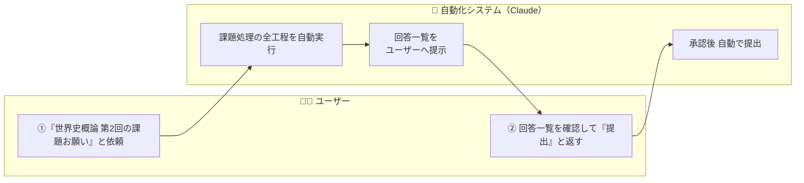
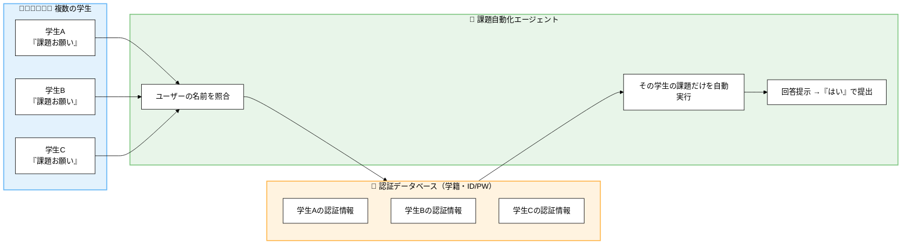
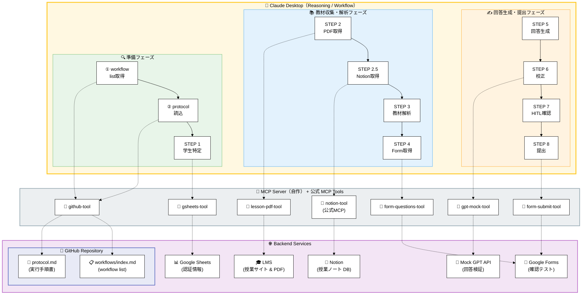

# Claude Desktop + MCP による課題自動化エージェントの実装

## はじめに

最近 AI が話題ですが、今回は「ある学生の課題を Claude だけで完結させる」仕組みを作ってみました。

Claude の remote MCP ＋ TypeScript で構築したローカル MCP Server により実現しています。

まずはデモ動画をご覧ください。

---

## デモ動画

- 学生がどのように大学の課題を行なっているのか
- AI エージェントによってどう変わるのか
  をお見せします
  > **[YouTube デモ動画]**
  > @[youtube](DwKwE1rcBeY)

## GitHub

@[card](https://github.com/m235ibmw/ai-orchestrator)

---

## 1. プロジェクト概要

### なぜこれを開発しようと思ったか

3 つ

- HITL 業務フロー / AI オーケストレーションによる AX を手を動かして理解したかった
- MCP という概念を深く理解したかった
- Claude Code を使った "バイブコーディング" を体感したかった

### 取り上げた業務ドメイン

- 誰でも理解できる「大学生の課題処理」業務

### 開発時間・開発方法

- Claude Code Max Plan（5x）をフル活用
- ChatGPT 5.1 で要件を事前に精緻化
- **バイブコーディング**（音声で要件定義 →AI が実装）による、仕様書駆動のウォーターフォール開発
- MCP という概念を知ってから **わずか 3 日、実働 7 時間** で PoC 完成

（恐るべしバイブコーディング！）

### このプロジェクトの特徴

- **1:N のスケーラビリティ**: 学生名簿があれば複数の学生の課題を並行処理可能
- **Claude がリーズニングを行い MCP で全ての操作を自動化**

---

## 2. As-Is（現状の学生フロー）

### 現行業務のステップ

(動画でも説明してるのでみなくても ok)

```mermaid
%%{init: {'theme':'base', 'themeVariables': { 'primaryColor':'#fff','primaryTextColor':'#000','primaryBorderColor':'#000','lineColor':'#000','secondaryColor':'#fff','tertiaryColor':'#fff','secondaryTextColor':'#000','tertiaryTextColor':'#000','textColor':'#000','nodeTextColor':'#000'}}}%%
flowchart LR

subgraph LMS["📘 LMS（授業資料置き場）"]
    L1["ログインして授業ページを開く"]
    L2["授業レジュメのPDFをダウンロード"]
end

subgraph GF["📋 Google Form（確認テスト）"]
    F1["確認テストを開き 設問と選択肢をコピー"]
    F2["GPTの回答を転記"]
    F3["送信ボタンを押して提出"]
end

subgraph Notion["📝 Notion（授業ノート）"]
    N1["授業ノートを開く"]
    N2["必要な部分をコピー"]
end

subgraph GPT["🤖 ChatGPT（解答作成）"]
    G1["PDFを貼り付ける"]
    G2["Google Formの設問を貼り付ける"]
    G3["ノートを貼り付ける"]
    G4["『これらを元に問題を解いてください』と依頼"]
    G5["最終回答を確認"]
end

Start["開始"] --> L1
L1 --> L2
L2 --> F1
F1 --> G1
G1 --> G2
G2 --> N1
N1 --> N2
N2 --> G3
G3 --> G4
G4 --> G5
G5 --> F2
F2 --> F3
F3 --> End["終了"]

style Start fill:#EEEEEE,stroke:#9E9E9E,stroke-dasharray:3 3,color:#000
style End fill:#EEEEEE,stroke:#9E9E9E,stroke-dasharray:3 3,color:#000
style LMS fill:#E3F2FD,stroke:#64B5F6,stroke-width:2,color:#000
style GF fill:#FFEBEE,stroke:#E57373,stroke-width:2,color:#000
style Notion fill:#E8F5E9,stroke:#81C784,stroke-width:2,color:#000
style GPT fill:#FFF8E1,stroke:#FFD54F,stroke-width:2,color:#000
```

### Pain Points

- **作業全体のうち "判断が必要な工程" はほとんどゼロ**
  - 判断が必要なのは、GPT の **解答の妥当性を確認する数十秒だけ**
  - 極めて機械的で非生産的な時間である
- 使うツールが多く、PC 操作が苦手な学生だと負担が増える

---

## 3. To-Be（自動化後の理想フロー）

### このシステムのゴール

- ユーザー操作を「最初の依頼」と「提出確認」のみに削減
- 回答の品質を **GPT（二次推論）で整合チェック** し、信頼性を担保
- HITL によって「AI 暴走リスク」と「品質保証」を両立

### ユーザーが行うことは 2 ステップだけ

1. 「世界史概論の第 2 回の課題お願い」と依頼する
2. Claude が回答一覧を提示したら「はい」と返す

> **[図 2: To-Be 業務フロー図]**

### このシステムの価値

#### ① 業務フローの改善

**会話型インターフェース**: 「世界史概論の課題お願い」と話しかけるだけで全工程を自動実行

**HITL による安全性**: 学生特定時と回答提出前の 2 箇所で確認を挟み、AI 暴走リスクを排除

#### ② 1:N のスケーラビリティ

> **[図 3: 1:N スケールモデル図]**

**学生名・学籍番号・LMS ID/PW があれば、何百人もの課題を自動で代行可能**。DB に学生名簿を保存しておけば、Claude が曖昧検索で該当学生を自動特定し、その学生の課題だけを実行できる。

仮にこれが実務で、1000 人が同じ業務をしていれば、毎日 5000 分を生み出すことができる。

---

## 4. Fit & Gap 分析と実装のポイント

### (ここからエンジニア向け！ "今後の展望"まで読み飛ばしても ok！)

このプロジェクトの機能要件は以下の 2 つに分けることができる：

- 「実際のブラウザ・データ操作」
  ┗ 業務フロー
- 「AI の振る舞いを一定に保つワークフロー制御」
  ┗ ワークフロー制御

:::details 業務フローの機能要件

| 要件カテゴリ           | 具体的な要件                             | Fit / GAP | 理由                                                             |
| ---------------------- | ---------------------------------------- | --------- | ---------------------------------------------------------------- |
| データ入力・利用者識別 | 学生名の曖昧検索（くり/栗原/kurihara）   | ◯ Fit     | 言語理解・曖昧検索は生成 AI が得意                               |
| データ入力・利用者識別 | 学生候補リストの提示とユーザー選択       | × GAP     | AI が「必ず確認を挟む」ことは保証できず、外部制御が必要          |
| 外部データ取得         | Google Sheets から学生情報を取得         | △ GAP     | データ取得自体は可能だが、専用の取得レイヤーを自作する必要がある |
| 資料取得               | LMS にアクセスして教材（PDF）を取得      | × GAP     | AI はブラウザ操作を行えず、仮想ブラウザの実行環境が必須          |
| 資料解析               | 教材 PDF の解析（テキスト抽出）          | × GAP     | PDF のダウンロードや解析は AI 単体では不可能                     |
| テスト情報取得         | Google Form から設問・選択肢を抽出       | × GAP     | 画面操作や DOM 解析は AI には不可能                              |
| 回答生成               | 教材内容を理解し、設問に対して回答を生成 | ◯ Fit     | 推論と質問応答は AI の中心能力                                   |
| 回答検証               | 回答を GPT で二次チェックする            | × GAP     | AI 単体は外部 API を呼べないため、実行レイヤーが必要             |
| 回答提出               | Google Form への自動入力・提出           | × GAP     | 画面操作は AI では不可能で、実行レイヤーが必須                   |

:::

:::details ワークフロー制御要件

| 要件カテゴリ     | 具体的な要件                                   | Fit / GAP | 理由                                                                    |
| ---------------- | ---------------------------------------------- | --------- | ----------------------------------------------------------------------- |
| ワークフロー制御 | 全ステップを決められた順序通りに実行           | × GAP     | AI はステップを省略・最適化してしまうため、外部の"振る舞いルール"が必要 |
| ワークフロー制御 | 各ステップで対応した mcp ツールを使う          | × GAP     | 外部ルールが必要                                                        |
| ワークフロー制御 | 不明点がある場合は必ず質問する                 | × GAP     | AI 単体では推測で先に進むことがある                                     |
| ワークフロー制御 | エラー時に即停止し、勝手に修復・リトライしない | × GAP     | AI は自動修復をしがちで、業務要件として不適合                           |
| ワークフロー制御 | ユーザーへの最後の「提出して良いですか？」確認 | × GAP     | AI に "必ず確認を挟む" という行動保証はない                             |
| UI 制御（表示）  | STEP ログを統一フォーマットで出力              | × GAP     | 出力形式を AI だけで統一するのは困難で、外部にルールを持たせる必要      |
| UI 制御（表示）  | 成功/失敗メッセージの統一                      | × GAP     | AI 単体では揺れが出やすい                                               |

:::

### Gap を埋める実装方針

#### 「実際のブラウザ・データ操作」

- すでに remote MCP tool で提供されているものは、Claude Desktop で接続
- 存在しない場合、API を伴う処理をラップした MCP tool を構築し、自作の MCP server 経由で Claude Desktop に渡す

#### 「ワークフロー制御要件」

- タスクを開始する前に AI は必ず GitHub からワークフロー定義ドキュメントを pull して、それ通りに進める

### システムアーキテクチャ

> **[図 4: システムアーキテクチャ図]**

> Claude Desktop → MCP Tools → Backend Services の 3 層構造

### 技術選定と実装

**Claude Desktop + MCP アーキテクチャ**

- 会話型 UI で学生が直感的に操作可能
- HITL を自然に組み込める
- 既存 MCP（Google Sheets、Notion）を追加コード不要で利用

**自作 MCP Server（TypeScript + Puppeteer）**

- 既存 MCP にない機能（LMS ログイン、PDF 解析、Form 操作）のみ実装
- 必要最小限の開発で実用レベルを達成

### 技術的工夫点

#### ① Reasoning（推論）と Execution（実行）の分離で拡張性と安全性を両立

「AI に考えさせること」と「実際に実行すること」を分離：

| 層                   | 役割           | 具体例                                                |
| -------------------- | -------------- | ----------------------------------------------------- |
| **Claude（推論）**   | 意味理解・判断 | 「栗原」「くり」を同一人物と判断 / 回答の妥当性を評価 |
| **Protocol（制御）** | 実行ルール定義 | 「学生特定後は必ず確認」「エラー時は停止」            |
| **MCP（実行）**      | 実際の処理     | LMS ログイン / PDF 解析 / Form 自動入力               |

**メリット**:

- AI は賢いが「必ずルール通り」とは限らない → Protocol で強制
- 新ワークフロー追加時、Claude 本体は変更不要 → Protocol と MCP だけ追加

#### ② ワークフローの 1:N スケーラビリティ（Claude 1 体で何百種類の業務も処理）

このシステムは **1 人の Claude が、何百種類もの業務フローを使い分けられる** よう設計している。

実現方法は「ワークフローリスト」と「プロトコル」の二層構造：

**第 1 層：ワークフローリスト**

- 登録されている全ワークフロー（世界史課題、日本史課題、レポート作成...）の一覧
- ユーザーの依頼から該当するワークフローを特定する役割

**第 2 層：プロトコル（実行手順書）**

- 特定されたワークフローの具体的な実行手順を記述
- 例：世界史課題なら「LMS ログイン →PDF 取得 →Form 解析 → 回答生成 → 提出」

**なぜ二層構造にしたのか**:

- **コンテキストウィンドウの節約**: 全ワークフローのプロトコルを毎回読み込むとトークンを大量消費してしまう
- **応答速度の改善**: 必要なプロトコルだけを取得することで、Claude の初動を高速化
- **スケーラビリティ**: ワークフローが 100 種類に増えても、1 つずつ取得するため処理が重くならない

**拡張のしやすさ**:

- 新しい業務を追加したい場合、プロトコルを 1 つ書くだけ
- Claude 本体の再訓練やコード変更は不要
- **セクション 3 の図 3 で示した「学生の 1:N」に加えて、「ワークフローの 1:N」も実現**

#### ③ 仕様書駆動バイブコーディング × ウォーターフォールで高速開発を実現

**バイブコーディング**とは、音声入力（SuperWhisper）で要件を話し、GPT が仕様書を生成し、Claude Code がその仕様書通りにコードを書く開発スタイル。

**なぜ音声入力なのか**:

個人開発のボトルネックは「タイピング」と「仕様書作成」だと気づいた。

- 最寄駅から家に帰るまでの徒歩時間
- 夜、部屋で電気を消してから寝るまでの時間
- 車を運転している時間

こうした「手が空いていない時間」や「PC の前にいない時間」に、SuperWhisper で頭にある内容を口頭でブレスト。タイピングや資料作成よりも **圧倒的な速度で要件を固めることができた**。

**なぜこの方式が有効だったか**:

- MCP 環境はデバッグが重い（サーバー再起動・接続確認に時間がかかる）
- 仕様を事前に固めてから実装することで、手戻りを最小化
- 音声 → 仕様書 → コード という流れで、**実働 7 時間で PoC 完成**

**開発フロー**:

1. SuperWhisper で「こういう機能が欲しい」と話す
2. GPT-5.1 が仕様書（Fit & Gap、プロトコル定義）を生成
3. Claude Code が仕様書を読んで MCP Server を実装

:::details 処理の流れ詳細

| 区分              | 処理内容（概要）                                        | Claude の役割                       | MCP の役割                      |
| ----------------- | ------------------------------------------------------- | ----------------------------------- | ------------------------------- |
| 1. トリガー       | ユーザーの依頼を受け取り「課題処理タスク」を認識        | 意図理解・タスク分類                | -                               |
| 2. プロトコル読込 | GitHub から workflow/proto を取得して実行ルールをロード | プロトコル読解・手順決定            | GitHub 接続 (remote MCP)        |
| 3. 初期化         | 必要な MCP（gsheets・notion・仮想ブラウザ等）を準備     | 各 MCP を呼び出し可能な状態にセット | 各 MCP サーバーが起動           |
| 4. 学生特定       | 名前曖昧検索 → Google Sheets で該当学生を特定           | 曖昧検索推論・結果マッチング        | gsheet MCP：レコード取得        |
| 5. LMS ログイン   | 仮想ブラウザで LMS にログインし教材ページへ到達         | 手順制御・成功判定                  | 仮想ブラウザ MCP：ログイン処理  |
| 6. PDF 取得・解析 | 教材 PDF を取得 → サーバー内部でテキスト化              | 内容を理解して次工程へ送る          | 仮想ブラウザ MCP：DL／PDF 解析  |
| 7. Form 解析      | Google Form から設問＋選択肢を抽出                      | 設問構造を理解・整形                | 仮想ブラウザ MCP：DOM 解析      |
| 8. 一次回答生成   | PDF × 設問を照合し回答を生成                            | 推論能力で回答生成                  | -                               |
| 9. 二次校正       | GPT Mock API で整合性チェック                           | 校正結果の判断                      | GPT Mock MCP：外部 API 呼び出し |
| 10. HITL 確認     | 回答一覧を提示 → 「提出して良いですか？」               | ユーザーに説明・確認を取る          | -                               |
| 11. 自動提出      | Google Form に回答を自動入力し送信                      | 送信完了の確認・ログ表示            | 仮想ブラウザ MCP：入力 & submit |
| 12. 完了処理      | プロトコル UI ルールで最終ログを整形して提示            | UI 整形・完了メッセージ表示         | -                               |

:::

---

## 5. 今後の展望

### 時代背景：DX から AX（AI Transformation）へ

#### AI オーケストレーション前提の業務フローが当たり前になる

少し前まで DX が話題だったが、これからは **AX の時代** が来ると確信している。

DX によって整備された SaaS や ERP パッケージ基盤の上に、AI オーケストレーションが乗っかる形で、業務フローが根本的に変わっていく。例えば、SAP のような既存システムに対して MCP 接続し、生成 AI のチャットインターフェースで情報を Read/Write できる未来がすぐそこまで来ている。
つまり、仕事が生成 AI で基本的には進められる。

#### デリバリーが爆速化し、コンサルの価値が変わる

本質には、AI は実行はできても、目的を生み出すことはできない。
＝解くべき課題を決めることができない。

だからこそ、**IT コンサルの価値の本質** は以下に集約される：

- **As-Is / To-Be の設計**
- **アプローチ選択**
- **ソリューション選択**

#### AI オーケストレーション時代の 3 つの課題

この時代には 3 つの課題が顕在化すると言われている：

**① セキュリティ**
→ ビッグテックや業界標準技術が吸収していく見込み

**② リライアビリティ（信頼性）**
→ ① 同様に技術進化によって解決される領域

**③ スパゲティ化（最大の課題）**
→ これが本質的な問題だ。

AI 同士が絡み合い、既存ツールとの連携が複雑化し、業務フローがスパゲティ状態になる。この混乱を整理し、最適な業務フローを設計するコンサルティングが、**これから爆発的に伸びる** と確信している。

---

### 目指すキャリア：IT コンサル × AI オーケストレーション

自分はソフトウェアエンジニアと起業経験がある。技術とビジネスの両方に触れた原体験から、**AX 時代の IT コンサル** を目指したい。

#### AX は小規模から効く → 独立しやすい時代

SAP などの標準パッケージは大企業向けで導入コストが高く、小規模企業には不向きだった。

一方、**AI オーケストレーション（LAM: Large Action Model）は小規模から効く**。導入コストが低く、中小企業やスタートアップでも即座に価値を出せる。

つまり、DX と違って AX は **小さいところから価値提供がしやすい** ため、IT コンサル × AI オーケストレーション人材として独立もしやすい。これが AX 時代の大きなチャンスだ。

#### まずは基本：新卒では DX から始める

ただし、いきなり AX に飛びつくのではなく、**まずは DX の基本を理解する** ことが重要だと考えている。

Web 2.0 時代の SaaS 基盤、クラウドインフラ、既存の業務システム設計を理解していないと、「DX に対して AI をどう組み合わせるか」という思考回路が育たない。

だからこそ、**新卒時点ではまず DX をしっかりやる**。その上で、AI オーケストレーションを組み合わせた AX へとキャリアを広げていきたい。
