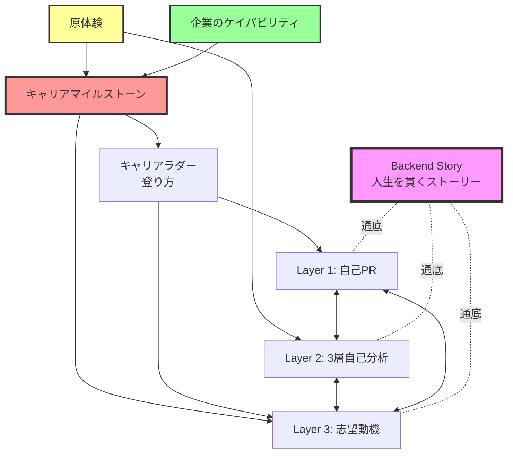

# 就活をシステム化する: Gemini 学生プランで使う「戦略的就活 OS」テンプレート配布

〜スプレッドシートをコピーするだけで、Gemini で戦略的な就活ができる〜

---

:::message
**AI との対話を今すぐ始める**

こちらのリンクで記事をコピーして、お使いの AI に貼り付けてください 👇  
👉 **https://zenn-doc-viewer.vercel.app/zenn3**

お使いの LLM がスムーズに対話を始められるよう、コピペ記事にはプロンプトを仕込んであります！  
そのままコピペしてお使いください。

では本題に入ります！
:::

## はじめに

就活を「とりあえず受けまくる」「先輩のアドバイスを聞いて動く」「面接慣れすればなんとかなる」で進めていませんか？

それも一つの戦略ですが、**もう一つ別のアプローチがあります。**

**「就活というゲーム」を自分なりに解釈し、仮説を持って戦略的に進める方法です。**

本稿では、Gemini 3 Pro の巨大コンテキストウィンドウを活用し、就活を「ゲーム」として分解・システム化した実践を紹介します。

**対象読者:**

- Gemini 学生プラン（有料プラン無料）を使える学生
- 「とりあえず」ではなく、仮説を持って戦略的に就活を進めたい人
- ES や面接で一貫性のあるストーリーを作りたい人

## 💡 まず動画で全体像を理解する（3 分）

**スプレッドシート URL:**

```
https://docs.google.com/spreadsheets/d/1Kg3jw0p78803E7RDVNPl9X3ZCUK-CT0LSlXI60nxCxE/edit?usp=sharing
```

**【デモ動画】**

@[youtube](4zl6upMLbKs)

---

### ⚠️ 実際に使うための準備（重要）

**このスプレッドシートをコピーしただけでは、まだ使えません。**

以下の 2 つの作業が必要です：

#### 1. スプレッドシートのリンクを差し替える

- `00_Magic_Prompt` シートの中身は、**私のスプレッドシートを参照**しています
- あなたがコピーしたスプレッドシートの URL に**差し替える必要**があります
- ChatGPT や Claude、Gemini に「この Magic Prompt の中のスプレッドシート URL を、私の URL に差し替えて」と頼めば OK です

#### 2. 初期データを書き換える

- シートの内容（`00_Game_Interpretation`、`04_KGI_List`、`08_Data_Lake`など）には、**私の就活データ**が入っています
- あなた自身の KGI（目標企業）、Backend Story、エピソードに書き換える必要があります

**対象読者:**
正直、このテンプレートは**エンジニアの素養がある学生**向けに配布しています。

スプレッドシートの構造を理解し、Magic Prompt を自分で書き換えられる方が対象です。

**個人的な話:**
もし私の大学の友達で、「使ってみたいけど設定が分からない」という方がいたら、**その辺の初期設定は手伝います。**
DM ください。

---

## 💬 実際の使用例: Gemini との対話

以下の 2 つのケースを見れば、このシステムが何をしてくれるのかが一発で理解できます。

---

### ✨ ケース 1: 企業別の戦略的 ES 執筆支援

**あなたが悩んでいること:**
「フューチャーの志望動機、どう書けばいいんだろう...？」

**Gemini に聞くだけ:**

**ユーザー:**

```
フューチャーのESで「志望動機」を書こうと思っています。
何かいい切り口がありますか？
```

**Gemini:**

```
了解しました。まず、以下を確認します：

1. 企業研究メモから、フューチャーの本質を確認
2. Backend Story から、フューチャーと接続できるエピソードを抽出
3. エピソード素材から、フューチャーに適したキャラクター設定を提案

[データレイクとKGIリストを確認中...]

✅ フューチャーの本質:

【企業としての稼ぎ方】
- 上流コンサル〜実装まで一貫して受注
- 大手SIerとの差別化: 技術への深いこだわり
- 自社プロダクト開発にも注力

【求める人物像】
- 技術とビジネスの両方を理解できる人材
- 上流だけでなく、実装の泥臭さも厭わない姿勢
- 若手でも主体的に動ける自走力

✅ 接続できるエピソード:
- Episode 1: 起業（技術とビジネスの両立への渇望）
- Episode 2: 受託開発（実装の泥臭さを知る）

✅ 推奨キャラクター設定:
**「技術で課題を解決する人間」（Solver型）**

💡 志望動機の切り口（提案）:

**軸:** 「技術とビジネスの両輪を回せるコンサルタントになりたい」

**ストーリー構成:**

1. **原体験（Episode 0）**:
   競技での挫折を経験 → 「技術で勝負したい」という渇望

2. **起業での気づき（Episode 1）**:
   技術だけでは勝てない。ビジネス視点が必要だと痛感。
   しかし、技術を捨てたくない。両方を武器にしたい。

3. **受託開発での学び（Episode 2）**:
   実装の泥臭さを経験。上流の綺麗な設計だけでは現場は回らない。
   「上流から実装まで一貫して見れる人材」の価値を実感。

4. **フューチャーへの必然性**:
   - 上流〜実装まで一貫 → 自分の強み（両方わかる）が活きる
   - 技術へのこだわり → 受託開発で培った実装力が評価される
   - 若手に裁量 → 主体的に動いてきた自分に合う

**具体的な志望動機文の骨子:**

「私は、技術とビジネスの両輪を回せるコンサルタントになりたいと考えています。

起業を通じて、技術だけでは勝てないことを痛感しました。しかし、その後の受託開発で、上流の綺麗な設計だけでは現場が回らないことも学びました。

フューチャーは、上流から実装まで一貫して関われる数少ない環境です。私の『技術もビジネスも理解できる』という強みを最大限活かし、クライアントの本質的な課題解決に貢献したいと考えています。」

この方向性でOKですか？
さらに深掘りしたい部分があれば教えてください。
```

**👉 何が起きているのか？**

- Gemini は、あなたが事前に整理した「Backend Story」と「企業研究メモ」を自動的にフェッチ
- フューチャーの本質（稼ぎ方・求める人物像）を抽出
- あなたのエピソードから、最適なものを選定
- ストーリーの骨子まで提案

**あなたがやることは、この提案をベースに執筆するだけ。**

---

### ✨ ケース 2: 選考日程を考慮した戦略的タスク提案

**あなたが悩んでいること:**
「今週、時間が取れそう。でも何から手をつければいいんだろう...？」

**Gemini に聞くだけ:**

**ユーザー:**

```
今週は時間が取れそう。何をすべき？
```

**Gemini:**

```
了解しました。KGIリスト（選考日程）と週次タスク在庫を確認します。

[シート確認中...]

✅ 直近の選考日程:
- フューチャー: ES締切 3日後（11/24）
- アビーム: 1次面接 5日後（11/26）
- アクセンチュア: Webテスト締切 7日後（11/28）

✅ 週次タスク在庫の状況:
- 優先度A: フューチャーES（未着手）
- 優先度A: アビームの面接対策（未着手）
- 優先度B: Webテスト対策（進行中）

📅 今週の最適タスクプラン:

【最優先】フューチャーES執筆（3時間）
理由: 締切が3日後。Backend Storyとの接続を固める必要あり。
特に「志望動機」で、起業→受託開発→フューチャーの必然性を論理的に接続する。

【次点】アビームの面接対策（2時間）
理由: 5日後に1次面接。想定質問リスト（「なぜコンサル？」「失敗から何を学んだ？」）を作成し、Backend Storyから即興で回答できる状態にする。

【余裕があれば】Webテスト対策（1時間）
理由: 締切まで7日。言語分野（苦手）の底上げ。

💬 この方針でOKですか？
フューチャーESから着手しましょうか？
```

**👉 何が起きているのか？**

- Gemini は、KGI リスト（選考日程）と週次タスク在庫を自動的にフェッチ
- 直近の締切を検知
- 優先度とタスクの重み付けを判断
- あなたの可処分時間に最適化したタスクプランを提案

**あなたがやることは、この提案に従って動くだけ。**

---

### 🎯 代表的な使用例

上記の 2 つは、このシステムの代表的な使い方です。

- **ケース 1**: ES 執筆で悩んでいる → Gemini が戦略的な切り口を提案
- **ケース 2**: 今週何をすべきか迷っている → Gemini が最適なタスクプランを提案

**重要なのは、LLM があなたの意図を理解し、スプレッドシート（データベース）にある情報をもとに推論を行うという点です。**

上記はあくまで例であり、あなたの問いかけ次第で無限のケースに対応できます。

**Gemini は、なんでも知っているあなたの就活コンサルタントになります。**

以降のセクションでは、「なぜこれが可能なのか」「どういう設計思想なのか」を解説します。

---

## 2. なぜこのシステムが必要なのか: 設計思想

### 2-1. 「仮説を持って戦う」就活

**従来の就活管理の問題点:**

- ❌ とりあえず受けまくる → 戦略なき消耗戦
- ❌ 先輩のアドバイスを鵜呑み → 自分の文脈に合わない
- ❌ 面接慣れすれば大丈夫 → 一貫性のないストーリーで矛盾が露呈

**このシステムのアプローチ:**

- ✅ 自分なりに「就活というゲーム」を解釈する
- ✅ 仮説を持って、データと戦略で勝つ
- ✅ 一貫性のある Backend Story で、全ての質問に即興で回答できる

### 2-2. このシステムの設計思想

- ✅ **HITL（Human-in-the-Loop）**: 意思決定は人間、実行支援は AI
- ✅ **Read-Only 原則**: Gemini は提案のみ、書き込みは人間
- ✅ **Context Injection**: 全ての文脈を Gemini に保持させる

---

## 3. ゲーム解釈: 就活を 3 ステップで分解する

システムを作る前に、まず **「就活」を概念レベルでどう解釈するか** が重要です。

エンジニアリングの第一歩は、複雑な変数を **「攻略可能なゲームのルール」** へと翻訳すること。

### Step 1: KGI（勝利条件）

**不変の目標を定義する**

- 例: 「アビーム内定 or アクセンチュア内定」
- なぜ不変にするのか: 感情でブレないための憲法

就活中、選考が進まない時期や、周囲の内定報告を聞いた時、人は無意識に目標を下げようとします。

「もう中堅でいいか...」「別の業界も見てみるか...」

しかし、**KGI を「憲法」として最初に定義し、不変にすることで、感情に流されず戦略的に動き続けることができます。**

### Step 2: Game Variables（管理すべき変数）

就活で管理すべき変数は、大きく 3 つに分類されます：

#### 1. Web テスト対策

- SPI や玉手箱などの筆記試験
- 足切りを回避するための必要最低限の対策
- 毎日 30 分、継続的に解く習慣を作る

#### 2. GD・ケース対策

- グループディスカッション
- ケース面接
- フレームワーク思考の訓練

**Web テスト・GD/ケースは、深く考える必要はありません。習慣的に積み上げるのが良いです。**

#### 3. ナラティブ（自己 PR・志望動機）

**ここがコアです。デッキ構成がすべてを決めます。**

ナラティブは、以下の 3 層構造で構成されます：

| 層          | 要素                         | 説明                                   |
| ----------- | ---------------------------- | -------------------------------------- |
| **Layer 1** | 自己 PR                      | あなたの強みと経験を端的に伝える       |
| **Layer 2** | 3 層自己分析                 | Backend Story から切り出したエピソード |
| **Layer 3** | 志望動機（キャリアビジョン） | なぜこの業界・企業か                   |

**具体例（IT コンサル志望の場合）:**

| 層                        | 実例                                   |
| ------------------------- | -------------------------------------- |
| **Layer 1: 自己 PR**      | 「自走力」「技術 × ビジネスの思考」    |
| **Layer 2: 3 層自己分析** | 3 つの時間軸でエピソードを構造化       |
| **Layer 3: 志望動機**     | 上流〜実装まで一貫した環境で成長したい |

この 3 つがどう繋がるかがイメージできたでしょうか？

**重要:** この 3 層は独立しているのではなく、**それぞれが絡み合って、企業ごとに最適化されたデッキ** を構成します。

---

**ここまでが、「就活というゲームの構造」の話です。**

**ここから先は、そのゲーム内でどう戦うかという 戦術（デッキ構築） に踏み込みます。**

##### 📊 デッキ構築のプロセス（企業ごとに実施）

**Step 1: 企業の本質を分析する**

まず、企業を 2 つの視点で分解します：

1. **稼ぎ方**: この企業はどうやって利益を生んでいるか？

   - 例: 上流コンサル〜実装まで一貫受注、技術への深いこだわり

2. **求める人物像**: どんな人材を求めているか？
   - 例: 技術とビジネスの両方を理解できる人材

---

**Step 2: 自己 PR を企業に寄せる（3 層自己分析を定義する）**

企業の本質に合わせて、**前に出す強み** と **深掘りで引き出される強み** を切り分けます。

正確には、これは **3 層自己分析を定義すること** です。

- **前に出す強み**: ES や自己紹介で最初にアピールする強み

  - 例: 「技術とビジネスの両方を理解できる」

- **深掘りで引き出される強み**: 質問されたときに補足する強み
  - 例: 「泥臭い実装も厭わない」「主体的に動ける自走力」

**重要:** 体感として、**前に出す強みよりも、引き出される強みの方が刺さります。**

なぜなら、**面接官側は「自分で発見した情報」の方を信頼するから**です。

質問を通して引き出された強みは、面接官が「自分で見抜いた」という構造になるため、納得度が高いのです。

なぜなら、面接官が自ら質問して引き出した情報の方が、納得感が高いからです。

**したがって、企業が求めている人物像にダイレクトに合致するのは、「引き出される強み」の方に設定すべきです。**

さらに、この引き出される強みは、**Backend Story、キャリアマイルストーン、キャリアラダー** といった他の部分でも一貫して通底するように設計します。

例:

- 引き出される強み: 「主体的に動ける自走力」
- Backend Story: 休学 → 起業という主体的な行動
- キャリアラダー: 「裁量がある環境で成長したい」
- 会社選び: 「若手に裁量を与える文化」

このように、引き出される強みを軸に、すべてのパーツが一貫して繋がります。

---

**Layer 2 の「3 層自己分析」とは？**

3 層自己分析は、あなたの強みと弱みを **3 つの時間軸** で構造化したものです：

| 層                         | 説明                 | 構造                    |
| -------------------------- | -------------------- | ----------------------- |
| **チーム（短期）**         | チームでの働き方     | 強み ↔ その裏返しの弱み |
| **個人の中期的な仕事**     | 個人で取り組む仕事   | 強み ↔ その裏返しの弱み |
| **個人の長期的な意思決定** | キャリアや大きな決断 | 強み ↔ その裏返しの弱み |

**例: 私の 3 層自己分析**

**1. チーム（短期）**

- **強み**: 素直に行動する → インターンで爆裂成果
- **弱み**: 素直すぎて断れない → 自身の処理能力を顧みず安請け合い
- **改善策**: no は no という勇気を持つ。ちゃんと擦り合わせて握る

**2. 個人の中期的な仕事**

- **強み**: 突き詰めてやる → 技術素地なしで半年でキャッチアップ
- **弱み**: 完璧主義 → マーケや営業資料にこだわりすぎて、泥臭いテレアポから逃げた
- **改善策**: まず何が必要か聞いて、それを終わらせることを重要視

**3. 個人の長期的な意思決定**

- **強み**: 成長意欲 → 起業に 2 回挑戦
- **弱み**: 大きな変化を好む（挑戦しすぎ） → 逆算で計画し、リスク顧みず突撃
- **改善策**: 順算で目の前のことをやるように徹底

**重要:** このように複数のレイヤーの強み・弱みのポートフォリオを作ることで、**「見せる強み」「引き出される強み」を設計できます。**

また、新卒就活では基本的に **「チーム（短期）」が最も重視されます。**

---

**Step 3: ケイパビリティ変換（能力の一般化）**

その会社に入社したら身につくであろう能力を特定し、**一般化されたケイパビリティ** に変換します。

**例: ある IT コンサルファームの場合**

- **会社で身につく能力**: IT PMO（プロジェクトマネジメントオフィス）
- **ケイパビリティに変換**:
  - テクノロジー（IT 知識）
  - PJ マネジメント（デリバリーマネジメント）

この一般化により、「この会社で得た能力は、他でも使える」という拡張性が生まれます。

---

**Step 4: キャリアマイルストーンを設定する**

ケイパビリティの到達点を **キャリアマイルストーン** として定義します。

**重要:** キャリアマイルストーンは、2 つの軸から導き出します：

1. **企業のケイパビリティの延長**: その会社で身につく能力の先にある到達点
2. **自分の原体験に紐づく**: Backend Story から逆算できる到達点

この 2 つの軸が交わる点が、あなたのキャリアマイルストーンです。

---

**例: VPoE（VP of Engineering）を目指す場合**

**1. 企業のケイパビリティの延長**

- IT PMO（テクノロジー × PJ マネジメント）の先にある到達点 → VPoE

**2. 原体験からの逆算**

- 起業で「技術だけでは勝てない」と痛感
- 技術 × ビジネス × 人間力を兼ね備えたリーダーになりたい
- → VPoE

この 2 つの軸が交わり、VPoE がキャリアマイルストーンになりました。

---

**重要:** VPoE は、本音で目指すかどうかは問題ではありません。

**明確にイメージできる像** を作ることが重要です。

**さらに、「どんな VPoE?」を企業特性に合わせてチューニングします:**

例: **「人間力のある VPoE」**

- VPoE には知見・経験も必要だが、何よりマネジメント職だから **人間力** がないと引っ張っていけない
- 人間力は、常にベストを尽くす必要のあるベンチャー気質の環境で身につく
- だから、この会社（逆算）

---

**Step 5: 自分なりのキャリアラダー（階段の登り方）を定義する**

キャリアマイルストーン（到達点）は決まりました。次は、**どうやってそこに登るか** を定義します。

キャリアラダーとは、**階段の登り方**、つまり **「どんな環境で、どんな働き方をすれば成長できるか」** という成長の道筋です。

**例 1: 裁量重視のキャリアラダー**

- **自己 PR との接続**:

  - 自己 PR に「主体性」「自走力」がある
  - 自分は裁量がある方が成長できると考えている

- **会社選びとの接続**:
  - 裁量が大きい環境 → ベンチャー気質の会社
  - だから、この会社

**例 2: 全体像把握重視のキャリアラダー**

- **自己 PR との接続**:

  - 自己 PR に「好奇心」「学習意欲」がある
  - 部分的な仕事ではなく、全体像を把握したいと考えている

- **会社選びとの接続**:
  - 上流〜実装まで一貫して関われる環境
  - だから、この会社

**例 3: 人間力重視のキャリアラダー**

- **自己 PR との接続**:

  - 自己 PR に「成長意欲」がある
  - VPoE には人間力が必要だと考えている
  - 知見や経験も必要だが、何よりマネジメント職だから人間力がないと引っ張っていけない

- **会社選びとの接続**:
  - 人間力は、常にベストを尽くす必要のあるベンチャー気質の環境で身につく
  - だから、この会社

このように、**自己 PR → キャリアラダー（登り方） → 会社選び** が論理的に接続されます。

---

**Step 6: 3 階層の問いに答える**

デッキ構築が完了すると、以下の 3 階層の問いにすべて答えられるようになります：

| 問い                                   | 答え方                                                        |
| -------------------------------------- | ------------------------------------------------------------- |
| **なぜ IT コンサルなのか？**           | ケイパビリティ変換 → テクノロジー × PJ マネジメントが身につく |
| **なぜ IT PMO をやってる会社なのか？** | キャリアマイルストーン → VPoE に必要な能力が身につく          |
| **中でもなぜ御社なのか？**             | ロジック（業務・ケイパの整合性） + 文化的共感（最後の一押し） |

**「なぜ御社なのか？」の構造:**

1. **ロジック（70%）**:

   - キャリアプランと会社の整合性
   - 業務として整合（IT PMO の経験が積める）
   - ケイパビリティとして整合（テクノロジー × PJ マネジメントが身につく）

2. **文化的共感（30%）**:
   - 最後の一押し
   - 例: 「御社のベンチャー気質」「挑戦を推奨する文化」「若手に裁量を与える姿勢」

---

**デッキの全体構造:**



---

##### 🎯 なぜこのデッキ構築が強力なのか？

従来の就活では、想定質問リストを作り、それぞれに回答を用意する「問答集アプローチ」が主流でした。

しかし、この方法には限界があります：

- ❌ 質問は無限に存在する → すべてを網羅できない
- ❌ 用意していない質問が来ると、矛盾が生じる
- ❌ 暗記した回答は、熱量と一貫性に欠ける

**一方、このデッキ構築アプローチでは:**

- ✅ すべての質問は、コア（Backend Story + デッキ）から導出できる
- ✅ 即興で回答しても、一貫性が保たれる
- ✅ 原体験から逆算されたストーリーなので、強力な熱量が生まれる

**重要:** このデッキ構成（コア）さえ固まれば、質問を無限に想定していくような問答集の作り方は不要です。

問答集は必要ですが、各論の質問はすべてコアから導出できます。

そして、すべてコアから出てくる回答なので、強力な熱量と一貫性が生まれます。

---

#### Backend Story（一貫性の根源）

**重要:** Backend Story は、「就活向けに切り取った時間軸の感じられないスナップショット」とは別に、**あなたの人生を貫く、時間軸を持ったストーリー** です。

- 自己 PR や志望動機は、Backend Story から「切り出されたエピソード」に過ぎない
- Backend Story は、**あなたの人生を貫く、通底したストーリー**
- 就活のために作るのではなく、**自分の人生のストーリーを認識する作業**

面接官は、あなたの「スペック」だけを見ているのではありません。
**「この人は、なぜこの選択をしたのか？」という一貫性** を見ています。

そして、その一貫性は、表面的なエピソードの寄せ集めではなく、**人生を貫くストーリー** から生まれます。

**私の例（タイムライン）:**

1. **原体験（挫折と決意）**

   - 中学生からの夢だった自転車競技でプロになるということが怪我でできなくなった
   - 自己の存在意義が揺らぐレベルで、とてつもない挫折感を感じた
   - 次に取り組むことでは絶対に成功すると決意

2. **初期衝動（圧倒的努力）**

   - 受験勉強にフルベット → 偏差値 30 近く向上

3. **スキル習得（再度のフルベット）**

   - 熱量が高すぎて休学
   - エンジニアの学習にフルベット
   - 長期インターンで実務経験を積む

4. **挑戦と成功**

   - 長期インターンから起業へ
   - ある程度軌道に乗った

5. **失敗と学び**

   - だけど失敗した
   - 技術だけでは勝てない
   - 人間力と社会人基礎能力、業界の deep な経験と知識が必要だと痛感

6. **解決策（なぜ就職か）**
   - だから就職する
   - コンサルで人間力とビジネスの基礎を学ぶ

**これが、志望動機や自己 PR といった「就活向けに切り取った時間軸の感じられないスナップショット」の下で、バックエンドで走り続けるストーリーです。**

あなた自身の Backend Story を認識し、それを軸に据えることで、どんな質問にも即興で一貫性を保って回答できます。

---

## 4. 設計思想: コンテキストウィンドウエンジニアリング

ゲーム解釈ができたら、次はそれをシステムに落とし込みます。

しかし、その前に重要な設計思想があります。

### 4-1. AI との協働の本質は「コンテキストウィンドウゲーム」

**あなたの AI がイケてない理由は、「AI の使い方が下手」という表層的な問題ではありません。**

**コンテキストウィンドウエンジニアリングがイケてないからです。**

AI との協働の本質は、**「コンテキストウィンドウゲーム」**です。

**AI とのやり取りは 2 つのフェーズに分解できます:**

1. **情報注入フェーズ（Context Injection）**: コンテキストウィンドウに情報を詰め込む

   - 例: ES をペースト、企業情報を入力、自己 PR の文章を入れる
   - **問題:** 何を、どの順序で、どのフォーマットで注入するかで、AI の出力品質が劇的に変わる

2. **ディスカッションフェーズ（Reasoning & Output）**: 注入した情報をもとに議論・提案を受ける
   - 例: 「この ES どう思う？」「志望動機が弱い気がするけど、どう改善できる？」
   - **問題:** コンテキストウィンドウが汚染されていると、的外れな回答が返ってくる

**つまり、AI との協働がうまくいかない本質的な理由は:**

- ❌ 「プロンプトの書き方が下手」（表層）
- ❌ 「AI の使い方がわかっていない」（表層）
- ✅ **「コンテキストウィンドウエンジニアリングができていない」（本質）**

### 4-2. コンテキストウィンドウの問題

**しかし、問題があります:**

- セッションあたりのコンテキストウィンドウには限界がある
- プロジェクトの情報量が多いほど、コンテキストウィンドウが汚染される
- ディープなディスカッションをすればするほど、LLM のアウトプット品質が劣化する

例えば、こんな経験はないでしょうか？

- 長い対話の後、AI の回答が的外れになってきた
- 複数の ES について議論していたら、情報が混ざってしまった
- セッションを新しく開き直すと、また一から説明しなければならない

### 4-3. 解決策: データレイクとセッションの疎結合

**だから、このシステムでは:**

- **データレイク（Google Sheets）** と **セッション（会話）** を疎結合にする
- データレイクは永続的に更新され続ける
- セッションは使い捨て（インスタンス）として、常に新鮮な状態で立ち上げる
- Magic Prompt で、新しいセッションが常にデータレイクをフェッチできる

```
┌─────────────────────────────────────┐
│  Data Lake (Google Sheets)          │
│  ━━━━━━━━━━━━━━━━━━━━━━━━━━━━━━━   │
│  永続的に更新され続ける              │
│  - Backend Story                     │
│  - 企業情報                          │
│  - エピソード素材                    │
│  - 選考日程                          │
└─────────────────────────────────────┘
              ↑ Fetch
              │
┌─────────────┴───────────────┐
│  Session 1 (使い捨て)       │ → 終了
└─────────────────────────────┘
              ↑ Fetch
              │
┌─────────────┴───────────────┐
│  Session 2 (新鮮)           │ ← 今ここ
└─────────────────────────────┘
```

**結果:**
→ **フレッシュな状態でディスカッションができ、LLM のアウトプット品質を担保できる**

これが、「なぜ Google Sheets を使うのか」「なぜ Magic Prompt が重要なのか」の理由です。

---

## 5. モジュール分解: 7 つの Module で構造化

ゲーム解釈と設計思想が固まったら、次はそれを「モジュール」に分解します。

各モジュールは独立した責務を持ち、Google Sheets の各シートに対応します。

### Strategic Module（戦略モジュール）

**役割:** 不変の目標と、月次のマイルストーン管理

- **KGI（不変の目標）**: 「アビーム内定 or アクセンチュア内定」
- **Monthly Outcome（月次マイルストーン）**: 「12 月: ES10 社提出」「1 月: 面接特訓月間」

### Asset Module（資産モジュール）

**役割:** 戦うための「素材」を管理

- **Backend Story**: 原体験（4 つのエピソード構造）
- **Character Stock**: 使えるエピソード素材（玉ねぎ農家、起業失敗、自転車など）
- **Target Data**: 企業研究メモ（企業の本質、求める人物像）

### Foundry Module（鋳造モジュール）

**役割:** 素材を「企業ごとの確定デッキ」に加工

- **Logic Foundry**: ロジック構築（Backend Story → 企業の本質への接続）
- **Snapshot Repository**: 企業ごとの確定デッキ（Anchor / Motivation / L1-L3 / Gap Strategy）

### Runtime Module（実行モジュール）

**役割:** 日々のタスク管理（アジャイル思考）

- **Weekly Backlog**: 週次タスク在庫（優先度付き）
- **Daily Action**: 今日の実行リスト（Plan / Doing / Done / Fail / Skip）

### Reflection Module（振り返りモジュール）

**役割:** 週次の振り返り

- **Weekly Review**: 計画 vs 実績、学びの記録

### Gateway Module（関門モジュール）

**役割:** 足切りリスクの検知

- **Bottleneck Detection**: Web テスト締切、ES 提出期限の自動検知

### Kernel Module（核モジュール）

**役割:** Gemini の振る舞いを定義

- **System Personality**: 専属 PMO・戦略参謀としての性格
- **Reasoning Protocols**: Tree Protocol / Optimization Protocol / Deck Building Protocol

---

## 6. システム要件: Google Sheets への落とし込み

モジュール設計が完了したら、最後にそれを Google Sheets の具体的なシート構成に落とし込みます。

### 5-1. シート構成一覧

| シート名                      | Module 対応        | 役割                                       | いつ使うか             |
| ----------------------------- | ------------------ | ------------------------------------------ | ---------------------- |
| **【Gemini ハンドリング層】** |                    |                                            |                        |
| `00_Game_Interpretation`      | Strategic, Asset   | 憲法・Backend Story・KGI 定義              | 初期設定のみ           |
| `00_Module_Architecture`      | 全 Module          | モジュール設計（7 つの Module の詳細）     | 初期設定のみ           |
| `00_Protocol`                 | Kernel             | Gemini の振る舞い定義                      | 初期設定のみ           |
| `00_Magic_Prompt`             | Kernel             | セッション起動用プロンプト                 | 毎回コピペ             |
| **【実行層】**                |                    |                                            |                        |
| `01_Daily_Action`             | Runtime            | 今日のタスク                               | 毎朝・毎晩             |
| `02_Weekly_Backlog`           | Runtime            | 週次タスク在庫                             | 週初・週末             |
| `03_Monthly_Roadmap`          | Strategic          | 月次成果目標                               | 月初                   |
| `04_KGI_List`                 | Strategic, Gateway | 企業管理 + WBS（選考日程）                 | 企業追加時・選考進捗時 |
| `05_Snapshot_{企業名}`        | Foundry            | 企業ごとの確定デッキ                       | ES 執筆前・面接前      |
| `07_Weekly_Review`            | Reflection         | 週次振り返り                               | 週末                   |
| `08_Data_Lake`                | Asset              | エピソード素材・企業分析                   | 新しい経験をした時     |
| **【メタ層】**                |                    |                                            |                        |
| `99_System_Admin`             | Kernel             | カタログ（各シートの列定義・構成を辞書化） | 初期設定のみ           |

### 5-2. 重要シートの詳細

#### 📂 `00_Magic_Prompt`（セッション起動）

**役割:**
Gemini セッション開始時にコピペするプロンプト。

これ一つで、Gemini が：

1. 必要なシート（Protocol / Game Interpretation / System Admin）を自動 fetch
2. あなたの KGI（勝利条件）を理解
3. Backend Story を把握
4. 「準備完了。何から始めますか？」と報告

**使い方:**
新しい Gemini セッションを開くたびに、このシートの内容をコピペする。

---

#### 📂 `01_Daily_Action`（今日のタスク）

**役割:**
今日の実行リスト。Gemini が「今日は 3 時間使える」という情報から、最適なタスクパズルを提案。

**列定義:**

| 列名      | 説明             | プルダウン選択肢                                           |
| --------- | ---------------- | ---------------------------------------------------------- |
| Date      | 実行日           | -                                                          |
| Timebox   | 見積もり時間     | 30min / 60min / 90min / 120min / 180min                    |
| Domain    | ドメイン分類     | 📚 WebTest / 🧠 GD/Case / 🗣 Narrative / 🛌 Rest / 🧘 Other |
| Task Name | タスク名         | -                                                          |
| Status    | 実行ステータス   | 📅 Plan / ▶️ Doing / ✅ Done / ❌ Fail / ⏭️ Skip           |
| Memo      | 振り返り・気づき | -                                                          |

**運用フロー:**

- **朝**: ユーザーが「今日は 3 時間使える」
- **Gemini**: Weekly Backlog と KGI List（WBS）を参照し、最適なタスクを提案
- **夜**: 結果を Status に記録

---

#### 📂 `04_KGI_List`（企業管理 + WBS）

**役割:**
企業リストと選考管理。**右側に WBS（選考日程）** があるのが最重要ポイント。

**列定義（左側: 企業情報）:**

| 列名     | 説明                                             |
| -------- | ------------------------------------------------ |
| 企業名   | 企業名                                           |
| Priority | 優先度（A / B / C）                              |
| Status   | 選考状況（ES 提出済 / 面接待ち / 内定 / お祈り） |
| Industry | 業界                                             |
| Position | 職種                                             |
| Note     | メモ                                             |

**列定義（右側: WBS）:**

| 列名           | 説明           |
| -------------- | -------------- |
| ES 締切        | ES 提出期限    |
| Web テスト締切 | Web テスト期限 |
| 1 次面接日     | 1 次面接の日程 |
| 2 次面接日     | 2 次面接の日程 |
| 最終面接日     | 最終面接の日程 |

**Gemini の活用:**
Gemini は、この WBS を参照して「3 日後に面接がある企業」を自動検知し、Daily Action で優先的にタスク提案する。

---

#### 📂 `05_Snapshot_{企業名}`（企業ごとの確定デッキ）

**役割:**
企業ごとに、「どのキャラクターで戦うか」「どのエピソードを使うか」を確定させたデッキ。

**構成要素:**

| 要素                   | 説明                                                         |
| ---------------------- | ------------------------------------------------------------ |
| **Anchor**             | どのキャラクターを演じるか（Challenger / Guardian / Solver） |
| **Motivation**         | なぜこの企業か（企業の本質との接続）                         |
| **L1 (Main Episode)**  | メインエピソード                                             |
| **L2 (Sub Episode)**   | サブエピソード                                               |
| **L3 (Minor Episode)** | マイナーエピソード                                           |
| **Gap Strategy**       | 凄み強化 vs 人間味強化のバランス                             |

**使い方:**

- ES 執筆前に、Gemini と対話しながらデッキを構築
- 面接前に、このデッキを見直して一貫性を確認

---

#### 📂 `08_Data_Lake`（エピソード素材管理）

**役割:**
雑多な生データを全て保存する場所。

**データ種別:**

- エピソード（玉ねぎ農家、起業失敗、自転車など）
- 企業分析メモ
- 面接での質問・回答ログ
- 全ての振り返りメモ

**運用:**

- ユーザーが「Data Lake に保存したい」と言うと、Gemini が整理して表形式で提示
- ユーザーが手動でコピペ（Gemini は書き込まない）

---

## 7. AI との協働: 思考スループット 10 倍の秘密

このシステムでは、AI（Gemini）との協働により、思考スループットが劇的に向上します。

### 6-1. 音声で考える（Super Whisper）

キーボードを捨て、音声で考えます。

- 要件定義書は書かない
- Super Whisper で、思考の断片、悩み、ボヤキを高速入力
- 人間は「書く」速度(Typing)ではなく「考える」速度(Thinking)で開発を進める

### 6-2. 2 つの Tree

AI との対話セッション自体を「プロジェクト」と見なし、以下の 2 つのツリー構造で管理します。

#### A. Task Tree（プロジェクトバックログ）

上位概念。システム構築全体の進捗を管理。

```
Job_Hunting_OS_Project/
│
├── 1. Game_Interpretation ✅ [FIXED]
│   ├── KGI定義 ✅
│   └── Backend Story構築 ✅
│
├── 2. Module_Architecture 🚧 [DISCUSSION]
│   ├── Strategic Module ✅
│   ├── Asset Module ✅
│   └── Runtime Module 🚧
│
└── 3. System_Requirements 💤 [STASH]
    └── Google Sheets実装
```

#### B. Logic Tree（現在の論点管理）

下位概念。議論が発散しないよう、今の文脈を構造化。

```
Current_Discussion_Scope/
│
├── 1. Daily_Action設計 🚧 [NOW]
│   ├── UI_Components ✅
│   │   ├── Date / Timebox / Domain ✅
│   │   └── Status Dropdown ✅
│   └── Gemini連携ロジック 🚧
│
├── 2. KGI_List設計 ✅ [FIXED]
│   └── WBS（選考日程）の右側配置 ✅
│
└── 3. Stashed_Issues 💤
    └── 他業界検討（後回し）
```

これを定期的に出力させることで、人間と AI の双方が「今、何について話しているか」を同期し、脳のメモリを開放します。

### 6-3. 叩き台効果（Strawman Proposal）

「AI に正解を出させる」のではありません。**「AI に叩き台(Strawman)を出させ、人間がそれを踏み台にする」** のです。

1. **Selection（選択肢の提示）**

   - 曖昧な指示に対し、AI に必ず「松・竹・梅」の 3 パターンの実装案を出させる

2. **Refinement（Yes, but...）**

   - 人間は 0 から考えず、提示された案に対して「方向性はいい(Yes)、でもここはこうしたい(But)」とフィードバックする

3. **Emergence（創発）**
   - この刺激により、人間側から AI の案単体では到達し得なかった **「より高度なアイデア(1 → 100)」** が引き出される

### 6-4. Protocol & Catalog

システム（スプレッドシート）の設計においては、AI が文脈を正しく扱えるよう情報の定義を分離しました。

- **Protocol（振る舞い）**: AI はどう振る舞うべきか

  - 例: Tree Protocol を使う、励ます、冗長な前置きをしない

- **Catalog（意味）**: データレイクにある雑多なデータが何を意味するか
  - 例: 「Priority: A」は単なる記号ではなく「最優先で動くべき企業」という文脈

---

## 8. なぜ思考スループットが「10 倍」になるのか

AI 活用による効果を分解すると、単純な足し算ではなく「掛け算」であることがわかります。

### Operational Efficiency（作業効率: ~3x）

音声入力と GAS 自動生成により、単純な実装・入力作業は物理的に速くなります。

しかし、これは本質的なレバレッジではありません。

### Strategic Efficiency（設計効率: Leverage）

ここが本丸です。

- **Game Interpretation**: AI との対話を通じて、最初から「イケてる設計（ドメインの正しい解釈）」と「クリティカルなロードマップ」が生成される
- **Critical Path**: **「解くべき課題」が初期段階で正確に特定される**
- これにより、迷走、手戻り、無駄な機能の実装といった、プロジェクトにおける「見えない損失」が消滅します

### Outcome: 速さ × 質

「作業の速さ(Speed)」×「設計の的確さ(Quality)」

本来トレードオフにあるこの 2 つを同時に実現することで、個人のアウトプット総量はリアルに 10 倍になります。

---

このシステム構築をもって、私の「AI PoC プロジェクト」は一区切りです。

**これから就活が終わるまで、新しい PoC は作りません。**

なぜなら、美しい論理とシステムを作るのは、ある意味「手段の目的化」だからです。

### 真の目的: 「実行の段差」を検証する

**私が信じているのは、こうです:**

- モデルが正しいかどうかは、実はどうでもいい
- 重要なのは、**何かを信じて、行動量を最大化すること**
- 自分で論理を作り、システムを構築し、それを信じて動く — それが私のスタイル

しかし、このスタイルを貫くにあたって、**実行部分に段差があるはず**です。

**例えば:**

- Backend Story を信じて面接に臨んだが、想定外の質問で詰まった
- Deck Building Protocol でデッキを作ったが、実際の ES 執筆では手が止まった
- Optimization Protocol の提案を信じて動いたが、体調や感情が邪魔をした

**ここからは、就活というドメインに深く潜り、「実行の段差」を検証します。**

それが、今回の PoC の本当のスコープであり、本当の目的です。

---

このテンプレートが、あなたの就活を加速させる一助となれば幸いです。

そして、私の検証結果 — 「信じて動く」というスタイルにおいて、何が障壁になったのか — も、いずれ共有します。

---

それでは、あなたの就活が成功することを願っています。
