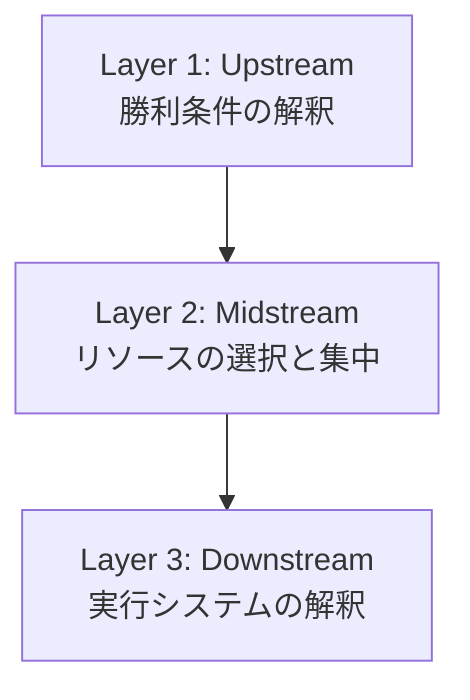

# prompt

この記事を読みました！  
ここから LLM と一緒に、私が気になるところを深掘りしたいです。

このプロンプトでは、

- 記事を書いた人＝「筆者」
- このプロンプトを送る人＝「ユーザー（私）」
- 応答する AI ＝「LLM」
  と呼びます。

まず、どのテーマについて話したいか選んでください 👇

1. エンジニアリング（AI との協働・設計まわり）
2. HITL（人が意思決定の中心に座る考え方）
3. ロードレースの話（筆者の“ゲーム解釈”やトレーニング設計）
4. その他（自由に聞きたいことがある）

次に、ユーザー（私）の属性を教えてください：

A. 次のどれに一番近いですか？

- エンジニア
- ローディ（自転車ロードレース経験者）
- その他（上のどれにも当てはまらない）

LLM は、この属性と選んだテーマに応じて、説明の深さや専門用語の使い方を調整してください。
====content below ===
AI との協働は「自動化」ではなく「設計」を変える技術だ

〜ロードレースをシステムへ翻訳するゲーム解釈と、思考スループットを 10 倍にする HITL 実践論〜

## はじめに

一昨日登場した Gemini 3 Pro の巨大コンテキストウィンドウが、
AI との協働（HITL）を一気に現実的にしてくれました。

本稿では、趣味であるロードレースのトレーニング管理システム構築を通じて、
思考スループットを爆増させる HITL 実践を紹介します。

---

## 💡 忙しい方へ

**この記事、長いです（約 8000 字）。** でもかなり頑張って作ったので、**2 つだけやって欲しい** です：

1. **下のコピペ用プロンプトを見る**
2. **お使いの AI（Claude/ChatGPT/Gemini）に貼り付けて、対話を始める**

「自分の領域でどう使えるか？」を AI と壁打ちする方が、この記事を最後まで読むより **10 倍価値があります。**

---

:::message
**AI との対話を今すぐ始める**

下記のリンクで記事をコピーして、お使いの AI に貼り付けてください 👇
URL
:::

---

## 1. 「E1 で 1 勝」を AI と目指した話

### Core Message: 意思決定の中心座

昨今の AI ブームにおいて、「自動化(Automation)」ばかりが注目されがちですが、本質はそこではありません。

真の価値は、**人間が常に意思決定ループの中心(HITL: Human-in-the-Loop)に座り続け、AI の推論力を借りて、判断の質と速度を極限まで高めること(Augmentation)** にあります。

Gemini 1.5 Pro のような超長文脈モデルの登場により、AI は単なる「コード生成ツール」から、プロジェクトの文脈を全て共有した **「専属 PMO」兼「壁打ち相手」兼「エンジニア」** へと進化しました。

### Stance: PoC ではなく実利の追求

本稿では、私の趣味である「ロードレース」を題材にします。

競技復帰に際し、来季から JBCF(実業団)E3 クラスタに登録し、最短で E1 へ昇格、そして **「E1 で 1 勝する」** という挑戦的な目標を掲げました。

これは「AI で何か作ってみた」という技術的な PoC(概念実証)ではありません。

**複雑な自転車というドメインを概念モデルとシステムに翻訳し、少しでも目標達成に近づけるための試みとなっています。**

---

## 2. ロードレースを「ゲーム」として分解する

システムを作る前に、まず **「現実のロードレース」を概念レベルでどう解釈するか** が重要です。

エンジニアリングの第一歩は、複雑な変数を **「攻略可能なゲームのルール」** へと翻訳すること。今回は以下の 3 層構造で定義しました。

**前提として:** 今回の目標は、JPT（ジャパンプロツアー）のような長距離ステージレースではなく、**E1 クラスの平地ベースのロードレース or クリテリウム**（2 分以内の登坂に限定）に絞っています。したがって、Tempo 以下の強度域は全て切り捨て可能という判断を下しています。



### Layer 1: 勝利条件の逆算 → 2 つの「べき論」

感情や精神論を排除し、ドライな数値と事実から逆算を行います。

- **Fact Base (事実の逆算)**

  - 「どうしたら強くなれるか」という漠然とした疑問ではなく、**「どういうレースがあって、どんなコースで、どうしたら昇格できるのか」** という事実を構造化します。
  - JBCF は明確なポイント制度があり、E3→E2→E1 と昇格していくシステムです。各カテゴリーで必要なポイント数と入賞確率を逆算することで、「E3 は 2 戦以内で昇格」→「E2 は 3 戦以内で確率論的に上位に入る」→「E1 では生存・参加・勝利の 3 ステップを踏む」というロードマップを定義しました。

- **Physics Base (能力の逆算)**
  - 「E1 で勝つ」という現象を物理法則に分解。
  - **まず戦略の前提: スプリントフルベット作戦。** E1 平地レースの勝負所はゴール前のスプリント一発です。それまでは徹底したエコ運転で無酸素容量(W'bal)を温存します。
  - この前提に立つと、必要な出力パターンは明確です。ゴール前で **「30sec 500W → 10sec 1000W」** という爆発的なパワー発揮が必要になります。
  - さらに重要なのが、**「ゴール前勝負まで無酸素容量(W'bal)の消費率を低く抑えた状態で到達する」** こと。つまり、レース中盤までに疲弊していては勝負できません。
  - **結果、目標値は以下:** FTP（機能的作業閾値パワー）は体重比 5.2W/kg、30 秒で 500W、10 秒で 1000W。これらをここから逆算して、必要なトレーニング強度を設定します。

---

**ここから戦略レイヤーへ。** 能力要件は定義できました。次は、限られた時間リソースの中で「何をやり、何をやらないか」を決めます。

### Layer 2: 週 10 時間の制約 → 何を「やらないか」を決める

- **Constraint (制約)**

  - 私は学生であり、学業、就職活動、そして AI の学習に時間を割く必要がある。
  - 自転車に割けるリソースは **「週 10 時間」** が限界であり、それ以上は割きたくない。

- **Selection (選択)**

  - **「何をやらないか」** を決定する。漫然としたロングライドや、習慣化していたソーシャルライド(付き合いの練習)には慎重になる必要があります。

  - **逆ピラミッド理論:**

    - 一般的なトレーニング理論では、ピラミッドの土台から積み上げます: LSD → SST → FTP → VO2Max → Anaerobic → 神経系。オフシーズンは長距離を乗り込む、という考え方です。
    - **しかし、私はこれが逆だと考えています。**
    - まず **VO2Max、そして無酸素(Anaerobic)。** これがないと話になりません。集団についていけないし、勝負所で勝てないからです。
    - LSD や SST は、**「まず距離の短いレースで勝てるようになってから、後でつければいい」** という判断です。
    - **つまり:** 最短で勝てる選手になり、その上で勝てるレースの幅を広げていく。それが、E1 というアマチュアレースに目標を絞り、かつ週 10 時間と「自転車だけで人生が埋まっていない」私にとっては、最適な戦略だと判断しました。

  - Layer 1 の物理要件を満たすために必須となる 3 つの強度のみにフルベットし、**ウェイトトレーニングのような「プログレッシブ・オーバーロード(漸進性過負荷)」** の思想を持ち込む。
    1. **Phase 1: 30/30 Intermittent（VO2Max と回復力）**
       - 具体的には、30 秒 L7（VO2Max 強度）→30 秒 FTP の 95%を 3 本で 1 セット、レスト 3 分を挟んで 6 セット実施。
       - プログレッシブ・オーバーロードの原則に従い、2 セッションで全セットの目標パワーを達成したら、次回は目標パワーを 8W 引き上げる。
       - **サイクル設計:** 2 日練習 →1 日休息。セッションの束を 5 回こなしたら 4 日の完全オフ。
       - **目標値:** 450W 程度が出せるようになれば、FTP5.2 倍の水準に到達すると計算。このペースでいつ頃 5.2 倍に到達するかを逆算できる。
    2. **Phase 2: SST 導入（ベース耐久と体幹強化）**
    3. **Phase 3: Anaerobic 導入（勝負所の爆発力）**
  - このように、明確な成長曲線(CTL 管理)を設計する。

---

**戦略が固まったので、次は実行システムの設計へ。** ここからは「カレンダー管理」という従来手法を捨て、アジャイル思考でシステムを組み立てます。

### Layer 3: カレンダー管理は破綻する → アジャイル思考へ

ここまでで「戦略」は FIX しました。あとはそれを実行するための「システム」です。ハードウェア(スプレッドシート)を作る前に、ここでも概念的なモデル設計を行います。

- **Fallacy of Calendar (カレンダーの誤謬)**

  - 従来の「カレンダー型管理(月曜は SST…)」は、肉体のコンディションや天候、急な予定という不確実性の前に必ず破綻します。これは **「ウォーターフォール開発の失敗」** と同義です。

- **Shift to Agile (アジャイルへの転換)**
  - トレーニング管理を **「プロダクトバックログ(DoD: 達成条件)」** へと変換します。
  - **Progression Tree（時間軸を無視したステップ定義）:**
    - 「370W 到達で RD メンテナンス」「400W 到達でパワーメーター購入解禁」「420W 到達でホイール購入解禁」といった、**能力と報酬の依存関係を RPG のスキルツリーのように可視化。**
    - 重要なのは、**時間軸を排除すること。** 「1 月にこれ、2 月にこれ」ではなく、「370W 達成したら次は 400W」という純粋な能力ベースのステップです。
    - この順序を上から順に攻略していくのが基本戦略です。
  - **Tactical Sprint（直近 1 週間の実行ボード）:**
    - Progression Tree で定義したステップを、**「今週どう実行するか」** に落とし込みます。
    - 「直近 1 週間」のみにフォーカスし、体調・天候・急な予定に応じて AI が柔軟にパズルを組みます。
    - Plan / Done / Skip / Fail のステータス管理で、実行 → 振り返り → 次週計画のサイクルを回します。
  - **つまり:** Progression Tree が「何を達成すべきか（戦略）」、Tactical Sprint が「今週どうやるか（戦術）」を分離管理する設計です。

---

**ゲーム解釈が完了しました。** ここからは、このドメイン知識をどうやって AI と共にシステム化したか、その協働プロセスを紹介します。

## 3. AI との「壁打ち」で 1 時間でシステムを作る方法

このシステム構築に、Jira や Asana のようなバックエンドのプロジェクト管理ツールは一切不要です。

Gemini の **巨大なコンテキストウィンドウ(Context Window)** に全ての要件、バックログ、論点を保持させることで、対話のみで完結させます。

:::message
さらに大規模な長期プロジェクトの場合は、データレイク基盤と Context Window への Fetch パイプラインが必要になりますが、この規模のプロダクト開発ならコンテキストウィンドウの保持力だけで押し切れます。
:::

### 音声で考える → キーボードを捨てる

要件定義書は書きません。Super Whisper を活用し、思考の断片、悩み、ボヤキを音声で高速入力します。

人間は「書く」速度(Typing)ではなく「考える」速度(Thinking)で開発を進めるべきだからです。

### 2 つの Tree → プロジェクト全体と今の論点を同期

AI との対話セッション自体を「プロジェクト」と見なし、以下の 2 つのツリー構造で管理しました。

### A. Task Tree (Project Backlog)

上位概念です。システム構築に限らず、プロジェクト全体の要件定義やブレスト段階から、常に全体像と今のスコープを把握するためのもの。

「要件定義」→「UI 設計」→「データ設計」といった議論のバックログを管理します。ある議論が完了すると、Task Tree が進行します。

### B. Logic Tree (Scope Management)

Task Tree の各論を決めるための下位概念です。

議論が発散しないよう、tree コマンドを用いてチャットの文脈自体を構造化します。

- **Fixed:** 決定した仕様
- **Discussion:** 今まさに議論している論点
- **Stash:** 後回しにする要素

これを定期的に出力させることで、人間と AI の双方が「今、何について話しているか」を同期し、脳のメモリを開放します。

**例 1: Task Tree（プロジェクト全体のバックログ管理）**

```text
Project_Road_to_E1_System_Map/
│
├── 1. Domain_Engineering (ゲーム解釈) ✅ [FIXED]
│   ├── Logic_Layer_1 (Victory Condition) ✅
│   └── Logic_Layer_2 (Selection) ✅
│
├── 2. System_Architecture (スプレッドシート構成) 🚧 [DISCUSSION]
│   ├── 01_Tactical_Sprint (実行ボード)
│   │   ├── UI_Design 🚧
│   │   │   ├── ✅ プルダウンメニューの実装 (トレーニング種類)
│   │   │   ├── ✅ 曜日ごとに背景色変更 (週末/平日)
│   │   │   └── 🚧 目標パワー入力欄のUX改善 (GAS連携)
│   │   ├── Data_Integration 🚧
│   │   │   ├── ✅ Strava API連携の可能性検討
│   │   │   └── 🚧 達成判定ロジックの見直し (IFTTT利用?)
│   │   └── Performance_Visualization 📈
│   │       └── 🚧 週間CTLのグラフ表示 (ダッシュボード要件)
│   │
│   ├── 10_Progression_Tree (戦略ツリー)
│   │   ├── ✅ ブレイクポイントの定義 (370W, 400W, 420W)
│   │   └── 🚧 各BP到達時の報酬/アンロック機能 (自動化)
│   │
│   ├── 02_Review_Log (振り返り)
│   │   └── ✅ 日次ログ入力フォームの設計
│   │
│   └── 03_Data_Lake (文脈データ)
│       └── ✅ ルール集 (俺ルール) のデータ構造定義
│
├── 3. Gear_Resource_Management (機材管理) ✅ [FIXED]
│   ├── Essential_List ✅
│   └── Stashed_List ✅
│
└── 4. Protocol_Definition (協働ルール) ✅ [FIXED]
    └── Behavior: "Strawman" Proposal ✅
```

**例 2: Logic Tree（現在の論点のスコープ管理）**

```text
Current_Discussion_Scope/
│
├── 1. Tactical_Sprint_Design (実行ボード設計) 🚧 [NOW]
│   ├── Automation_Level (自動化レベル)
│   │   ├── ❓ Logic Selection (松/竹/梅?)
│   │   └── 🚧 GAS Implementation (コード実装)
│   │
│   ├── UI_Components (入力項目)
│   │   ├── ✅ Date / Feel / Time (確定)
│   │   └── ✅ Status Dropdown (Plan/Done/Skip/Fail) (確定)
│   │
│   └── Feedback_Loop
│       └── 🚧 "Fail"時のリスケジュール・ロジック (次回検討)
│
├── 2. Progression_Tree (戦略) ✅ [FIXED]
│   └── Breakpoints: 370W / 400W / 420W
│
└── 3. Stashed_Issues (後回し) 💤
    ├── Strava API連携 (プラン松が却下ならStash)
    └── 将来的なチーム移籍検討
```

### 「叩き台」効果 → AI に正解を出させない

「AI に正解を出させる」のではありません。**「AI に叩き台(Strawman)を出させ、人間がそれを踏み台にする」** のです。

1. **Selection (選択肢の提示)**

   - 曖昧な指示に対し、AI に必ず「松・竹・梅」の 3 パターンの実装案を出させる。

2. **Refinement (Yes, but...)**

   - 人間は 0 から考えず、提示された案に対して「方向性はいい(Yes)、でもここはこうしたい(But)」とフィードバックする。

3. **Emergence (創発)**
   - この刺激により、人間側から AI の案単体では到達し得なかった **「より高度なアイデア(1 → 100)」** が引き出される。

### Protocol & Catalog → AI に文脈を教える

システム(スプレッドシート)の設計においては、AI が文脈を正しく扱えるよう情報の定義を分離しました。

- **Protocol (振る舞い):** AI はどう振る舞うべきか(Tree コマンドを使う、励ます等のルール)
- **Catalog (意味):** データレイクにある雑多なデータが何を意味するか("370W"という数値は、単なる数字ではなく"RD メンテナンスのトリガー"であるという文脈)

---

**協働手法を説明したので、次は成果物を見せます。** ここからは最も具体的なレイヤー（実装例）として、実際に作ったスプレッドシートを紹介します。

## 4. 完成したシステム: RPG 風スプレッドシート

上記のゲーム解釈と AI との対話を通じて構築したのが、以下のスプレッドシートです。

### システムの構成要素

#### 1. Tactical Sprint (実行ボード)

直近 1 週間のトレーニング計画。体調・天候に応じた柔軟な組み替えが可能です。

| Date        | Feel      | Time    | Mission 1                | Mission 2         | Status  | Memo                                                                 |
| ----------- | --------- | ------- | ------------------------ | ----------------- | ------- | -------------------------------------------------------------------- |
| 11/20 (Thu) | 🔴 Tired  | ⏱️ 1.5h | [MAIN] CrissCross (Lv.2) | (なし)            | ❌ Fail | 5 セット目 2 本目でダレ(203bpm)。座りっぱなし&糖質不足。             |
| 11/21 (Fri) | 🟡 Normal | ⏱️ 1.0h | [SUB] SST (Short)        | 🧘 Stretch        | ✅ Done | 昨日の疲労抜き SST。股関節周り重点的に。                             |
| 11/22 (Sat) | 🟢 Fresh  | ⏱️ 3h+  | [MAIN] CrissCross (Lv.2) | 🏋️ Core Training  | ✅ Done | リベンジ成功！補給しっかり摂ったら最後まで踏めた。心拍 195bpm 安定。 |
| 11/23 (Sun) | 🔴 Tired  | ⏱️ 2.0h | 🚴 Group Ride (LSD)      | (なし)            | ✅ Done | チーム練。強度は上げずツキイチでフォーム確認。                       |
| 11/24 (Mon) | 💀 Dead   | 🚫 0h   | 🛌 Rest                  | (なし)            | ✅ Done | 完全休養。仕事多忙。                                                 |
| 11/25 (Tue) | 🟡 Normal | ⏱️ 1.5h | [SUB] SST (90min)        | (なし)            | ⏭️ Skip | 雨のため中止。室内でプランクのみ実施。                               |
| 11/26 (Wed) | 🟢 Fresh  | ⏱️ 1.5h | [MAIN] CrissCross (Lv.2) | [SUB] Anaerobic A | ✅ Done | 2 回連続完送！次回から Lv.3 (+8W) へ移行可能。                       |
| 11/27 (Thu) | 🟡 Normal | ⏱️ 1.0h | 🛌 Rest                  | 🧘 Stretch        | 📅 Plan | 回復日。                                                             |
| 11/28 (Fri) | 🟢 Fresh  | ⏱️ 2.0h | [MAIN] CrissCross (Lv.3) | (なし)            | 📅 Plan | Lv.3 (370W) 初挑戦。RD メンテ予約済み。                              |
| 11/29 (Sat) | 🟡 Normal | ⏱️ 3h+  | 🚴 Group Ride            | [SUB] Anaerobic B | 📅 Plan | 週末の集団走行。ラストのもがきで 1000W 狙う。                        |
| 11/30 (Sun) | 🔴 Tired  | ⏱️ 1.5h | [SUB] SST                | (なし)            | 📅 Plan | 疲労度を見て調整。                                                   |

**ポイント:**

- **Feel (体調)**: 赤 🔴=疲労、黄 🟡=普通、緑 🟢=好調、💀=完全消耗
- **Status**: Done（完了）/ Fail（失敗）/ Skip（スキップ）/ Plan（予定）
- **Mission**: [MAIN]が主要トレーニング、[SUB]が補助

---

#### 2. Progression Tree (戦略ツリー)

時間軸を無視した純粋な能力ベースのステップ定義。370W / 400W / 420W のブレイクポイントで報酬・アンロック機能が解禁されます。

| Level | Status  | 🎯 Main Target (Power) | ⚙️ Unlock / Action               | 📅 Logic / Story                 |
| ----- | ------- | ---------------------- | -------------------------------- | -------------------------------- |
| Lv.1  | ✅ Done | 354W (完送)            | -                                | Base                             |
| Lv.2  | ▶️ NOW  | 362W (+8W)             | -                                | Now: ひたすら踏む                |
| Lv.3  | 🔒 Lock | 370W (+8W)             | 🔧 RD メンテ & ワイヤー & タイヤ | [BP1] 駆動系・足回りリフレッシュ |
| Lv.4  | 🔒 Lock | 378W (+8W)             | -                                | 400W への助走                    |
| Lv.5  | 🔒 Lock | 386W (+8W)             | -                                | 400W への助走                    |
| Lv.6  | 🔒 Lock | 394W (+8W)             | -                                | 400W への助走                    |
| Lv.7  | 🔒 Lock | 400W (The Wall)        | 🚀 PM & ハンドル                 | [BP2: Xmas] 無酸素系練 解禁      |
| Lv.8  | 🔒 Lock | 410W (+10W)            | 🔧 ステム/コラム調整             | [On Demand] ポジション微調整     |
| Lv.9  | 🔒 Lock | 420W (Target)          | -                                | [BP3] 5.2 倍達成                 |
| Ex.   | 🔒 Lock | Season In (Feb)        | 🏁 チーム装備一式                | 2 月頭：実戦モードへ移行         |

**ポイント:**

- **ブレイクポイント (BP)**: 370W（駆動系メンテ）/ 400W（パワメ＆無酸素練）/ 420W（FTP5.2 倍達成）
- **時間軸を排除**: 「1 月にこれ」ではなく「370W 達成したら次」
- **RPG 風の報酬設計**: 能力到達でアンロック

---

#### 3. Gear Resource Management (機材管理)

各ブレイクポイントで解禁される機材・メンテナンス項目。

| Category       | Item Name                   | Priority  | Timing / Trigger            |
| -------------- | --------------------------- | --------- | --------------------------- |
| Maintenance    | RD 調整・チェーン・ワイヤー | 🔥 High   | 370W (BP1)                  |
| Consumable     | タイヤ (GP5000)             | 🔥 High   | 370W (BP1)                  |
| Unlock         | パワーメーター (Assioma)    | 🚀 Unlock | 400W (BP2: Xmas/Anaerobic)  |
| Unlock         | ハンドル (Shallow/Aero)     | 🚀 Unlock | 400W (BP2: Xmas/Anaerobic)  |
| Position       | ステム & コラムカット       | 🔧 Adjust | 410W~ (On Demand)           |
| Season In      | チームエアロワンピース      | 🏁 Feb    | 2 月 シーズンイン           |
| Season In      | ヘルメット (OGK R2)         | 🏁 Feb    | 2 月 シーズンイン           |
| Season In      | アイウェア (ALTALIST)       | 🏁 Feb    | 2 月 シーズンイン           |
| Season In      | 夏用グローブ                | 🏁 Feb    | 2 月 シーズンイン           |
| Want (Stashed) | 冬用ウェア一式              | 💎 Want   | 既存で耐える (無理なら買う) |
| Want (Stashed) | 中華ホイール / クランク     | 💎 Want   | 結果が出ない時の切り札      |

**ポイント:**

- **能力トリガー**: 370W でメンテ、400W でパワメ購入といった明確な依存関係
- **Stash 機能**: 「後で考える」アイテムも可視化

---

このシステムは、「カレンダー」ではなく「バックログ」として機能します。

---

**具体的なシステムを見たので、最後に抽象レイヤーへ戻ります。** なぜこの手法で思考スループットが 10 倍になるのか、その理論を整理します。

## 5. なぜ思考スループットが「10 倍」になるのか

AI 活用による効果を分解すると、単純な足し算ではなく「掛け算」であることがわかります。

体感では、これまで 1 日かかっていた作業は 1 時間で、3 日かかっていた作業は **「家に帰って好きなアニメを見ながら Super Whisper で 1 時間雑多にディスカッションするだけ」** で完了します。だらだらと MTG をしている感覚で、最強のシステムが出来上がるのです。

### Operational Efficiency (作業効率: ~3x)

音声入力と GAS 自動生成により、単純な実装・入力作業は物理的に速くなります。しかし、これは本質的なレバレッジではありません。

### Strategic Efficiency (設計効率: Leverage)

ここが本丸です。

- **Game Interpretation:** AI との対話を通じて、最初から「イケてる設計(ドメインの正しい解釈)」と「クリティカルなロードマップ」が生成される。
- **Critical Path:** **「解くべき課題」が初期段階で正確に特定される**
- これにより、迷走、手戻り、無駄な機能の実装といった、プロジェクトにおける「見えない損失」が消滅します。

### Outcome: 速さ × 質

「作業の速さ(Speed)」×「設計の的確さ(Quality)」

本来トレードオフにあるこの 2 つを同時に実現することで、個人のアウトプット総量はリアルに 10 倍になります。

---

## 6. AI 時代に必要な 2 つの能力

これからの時代、コードを書く能力(How)の価値は相対的に低下します。

エンジニアリングに求められる能力は、以下の 2 点に集約されます。

1. **現実世界をゲームとして解釈する力(Domain Engineering)**

   - 業務ドメインをロジックツリーとレバーの重み付けに分解し、「解くべき課題(As-Is / To-Be)」を明らかにする力。

2. **AI をハンドリングして最適解を設計する力(HITL Management)**
   - AI とどう共存し、どう意思決定の中心に座り続けるか。AI オーケストレーションなどの技術論は、この中の各論に過ぎない。

この手法を用いれば、わずか 1 時間の対話で、現実を変えるための強力なシステムを構築できます。

これは、誰にでも開かれた **「個人の能力拡張(Augmentation)」** の扉なのです。
